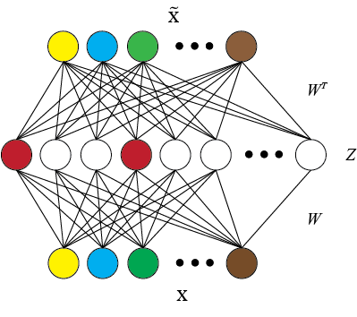

## SPINE: SParse Interpretable Neural Embeddings

SPINE is a tool to transform existing represesentations into interpretable ones. It is a novel extension of the k-sparse autoencoder that is able to enforce stricter sparsity constraints. It is highly expressive and facilitates non linear transformations in contrast to existing linear matrix factorization based approaches. 


<center>
<center>A k-sparse autoencoder. For an input X, an autoencoder attempts to construct an output X' at its output layer that is close to X. In a k-sparse autoencoder, only a few hidden units are active for any given input (denoted by the colored units in the figure).</center>


### Requirements

numpy <br>
pytorch 0.3 (along with torchvision) <br>
tqdm

### Input format requirements

The input embeddings, that you wish to transform, should be in the following format. Each line contains the word and its continuous representation in a space separated format

```
word1 0.4 0.2 0.42 ...
word2 0.23 0.54 0.123 ...
```


For the help menu, 

```bash
cd code/models/
python main.py -h
```

We recommend running the following setting:

```bash
python3 main.py --input input_file \
		 --num_epochs 4000 \
		 --denoising \
		 --noise 0.2 \
		 --sparsity 0.85 \
		 --output output_file \
		 --hdim 1000
```

A note of caution: Different input representations might require very different hyper-parameter setting. For instance, based on the range of the input representations, one should set how much noise to add for the denoising auto-encoder. For glove embeddings we found 0.4 noise level to be best, whereas for word2vec 0.2 noise level was more suitable (0.4 for word2vec was too much). Hence, you might have to play with a few a few hyper-parameter settings to attain the best accuracy/interpretability trade-off. Further, we also suggest visualizating the obtained representations.

### Word Embeddings

SPINE word vectors of original glove and word2vec vectors, along with word vectors from baseline [Sparse Overcomplete Word Vectors](https://arxiv.org/abs/1506.02004) (SPOWV) method, are available [here](https://drive.google.com/drive/folders/1ksVcWDADmnp0Cl5kezjHqTg3Jnh8q031?usp=sharing).

### Visualization

To qualitatively assess the resulting representations, follow this easy [ipython tutorial](code/evaluation/visualization/visualization_tutorial.ipynb).

### Evaluation
```bash
cd code/evaluation/

./setup.sh # to download the required datasets and dumps relevant pickle files

./run.sh <embeddings_absolute_path> # to evaluate embeddings on various extrinsic and intrinsic tasks

```


### Note

This is the official code for the following paper, if you use it please consider citing it.

```
@article{subramanian2018spine,
  title={SPINE: SParse Interpretable Neural Embeddings},
  author={Subramanian, Anant and Pruthi, Danish and Jhamtani, Harsh and Berg-Kirkpatrick, Taylor and Hovy, Eduard},
  journal={Proceedings of the Thirty Second AAAI Conference on Artificial Intelligence (AAAI)}
  year={2018}
}
```


